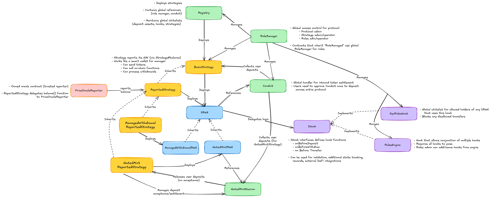

# Fountfi Protocol Technical Documentation

Fountfi is a protocol for tokenizing Real World Assets (RWA) on-chain, providing a secure and compliant framework for bringing traditional finance assets into DeFi.

## Deployments

### Base V1 Deployment \[2025-07-07\]

__Git Tag:__ `deploy-2050707`

__Audit:__ [Omniscia Audit Report](https://omniscia.io/reports/sova-network-fountfi-protocol-684adfa36579f5001821a219/)

__Deployer:__ [`0x76F2DAD4741CB0f4C8C56361d8cF5E05Bc01Bf28`](https://basescan.org/address/0x76f2dad4741cb0f4c8c56361d8cf5e05bc01bf28)

| Contract | Address |
|----------|---------|
| Role Manager | [`0x6c826Ea5664d64F570ed50d82107593c33af8A47`](https://basescan.org/address/0x6c826Ea5664d64F570ed50d82107593c33af8A47) |
| Registry | [`0x50f4EF3B29362abA1B9EA88E600B016d99c44C3E`](https://basescan.org/address/0x50f4EF3B29362abA1B9EA88E600B016d99c44C3E) |
| Conduit | [`0x66Df6ECcC14D8bd12249b587835D92125e9DBe71`](https://basescan.org/address/0x66Df6ECcC14D8bd12249b587835D92125e9DBe71) |
| KYC Rules Hook | [`0xD1b225374c64C87Cf0909910AF34e54021EFaEaA`](https://basescan.org/address/0xD1b225374c64C87Cf0909910AF34e54021EFaEaA) |
| Price Oracle Reporter | [`0xB8bBabD3134C18cA705dA904A73A86CB1001955a`](https://basescan.org/address/0xB8bBabD3134C18cA705dA904A73A86CB1001955a) |
| Strategy Implementation | [`0x66CA4C7973A73fd243563D068452F8D1C2D1E123`](https://basescan.org/address/0x66CA4C7973A73fd243563D068452F8D1C2D1E123) |
| Mock USD Token | [`0x295F16c13feA14c55289d16D83b2ABAAD3B820f3`](https://basescan.org/address/0x295F16c13feA14c55289d16D83b2ABAAD3B820f3) |

## Key Terms and Concepts

- **tRWA (Tokenized Real World Asset)**: An ERC4626-compatible token that represents ownership shares in an underlying real-world asset strategy.

- **Strategy**: A contract that manages underlying assets and deploys its own tRWA token. Strategies implement different investment approaches for the underlying assets.

- **Registry**: The central hub of the protocol that manages all component registrations and deployments, ensuring only authorized components can interact.

- **Conduit**: A security contract that manages all asset transfers between users and the protocol, providing a layer of protection for token movements.

- **Hook**: A pluggable validation component that enforces rules before token operations (deposits, withdrawals, transfers). Hooks enable extensible compliance mechanisms.

- **Rules Engine**: A special type of hook that coordinates multiple sub-hooks, allowing complex validation logic to be composed from simpler rules.

- **Reporter**: An oracle contract that provides asset valuations to the protocol, enabling accurate share pricing.

- **GatedMint**: A two-phase deposit mechanism where assets are held in escrow pending explicit approval, allowing for issuer control over flow of funds and timing of acceptance.

- **Deposit Escrow**: A contract that temporarily holds assets during the two-phase deposit process until they are either accepted or refunded.

- **Withdrawal Queue**: A mechanism for managing withdrawals from illiquid assets, allowing for orderly processing of redemption requests.


## Protocol Overview

The Fountfi protocol enables:

- Tokenization of RWAs with flexible strategy implementations
- Share-based accounting for RWA representation using ERC4626 vaults
- NAV (Net Asset Value) oracle integration via Reporter contracts
- Built-in KYC/AML compliance features with extensible hook system
- Two-phase gated deposit flow for compliance verification
- Advanced withdrawal management for illiquid assets
- Role-based access control for protocol administration

## Protocol Architecture




### Core Components

#### Registry

Central hub of the protocol that manages all component registrations and deployments.

**Key Functions:**

```solidity
// Register/unregister a strategy implementation template
function setStrategy(address implementation, bool allowed) external;

// Register/unregister a hook implementation
function setHook(address implementation, bool allowed) external;

// Register/unregister an asset token (e.g., USDC)
function setAsset(address asset, bool allowed) external;

// Deploy a new strategy instance and its token
function deploy(
    address implementation,
    string memory name,
    string memory symbol,
    address asset,
    uint8 assetDecimals,
    address manager,
    bytes memory initData
) external returns (address strategy, address token);

// Check if a token is a valid tRWA token
function isToken(address token) external view returns (bool);

// Get all deployed tokens
function allTokens() external view returns (address[] memory tokens);

// Get all deployed strategies
function allStrategies() external view returns (address[] memory strategies);
```

**Access Control:**
- `setStrategy`: Requires `STRATEGY_ADMIN` role
- `setHook`: Requires `RULES_ADMIN` role
- `setAsset`: Requires `PROTOCOL_ADMIN` role
- `deploy`: Requires `STRATEGY_OPERATOR` role

**Error Conditions:**
- `ZeroAddress()`: Implementation address is zero
- `UnauthorizedAsset()`: Asset is not registered
- `UnauthorizedStrategy()`: Strategy is not registered

#### Strategy

Investment vehicle component that manages assets and deploys its token.

**Types of Strategies:**

1. **BasicStrategy**: Abstract base implementation with core functionality
2. **ReportedStrategy**: Uses an oracle reporter for asset valuation
3. **GatedMintRWAStrategy**: Implements two-phase deposit with approval flow

**Key Functions (BasicStrategy):**

```solidity
// Initialize a new strategy
function initialize(
    string calldata name_,
    string calldata symbol_,
    address roleManager_,
    address manager_,
    address asset_,
    uint8 assetDecimals_,
    bytes memory
) public virtual;

// Get the total asset balance (abstract, implemented by derived strategies)
function balance() external view virtual returns (uint256);

// Update the strategy manager
function setManager(address newManager) external;

// Asset management functions (restricted to manager)
function sendETH(address payable recipient, uint256 amount) external;
function sendToken(address token, address recipient, uint256 amount) external;
function pullToken(address token, address from, uint256 amount) external;
function setAllowance(address token, address spender, uint256 amount) external;

// Get the strategy's token address
function shareToken() external view returns (address);
```

**Additional Functions (ReportedStrategy):**

```solidity
// Get balance from reporter
function balance() external view override returns (uint256);

// Update the reporter contract
function setReporter(address _reporter) external;
```

**Access Control:**
- Most functions require `STRATEGY_ADMIN` role or manager
- All asset management functions require manager (STRATEGY_OPERATOR)

**Error Conditions:**
- `AlreadyInitialized()`: Strategy already initialized
- `InvalidAddress()`: Zero address for critical parameters
- `InvalidReporter()`: Reporter address is zero

#### tRWA Token

ERC4626-compatible tokenized RWA vault that represents ownership shares in the underlying strategy.

**Types of Tokens:**

1. **tRWA**: Standard implementation with hook system
2. **GatedMintRWA**: Two-phase deposit implementation with escrow

**Key Functions (tRWA):**

```solidity
// Standard ERC4626 deposit functions (with hook validation)
function deposit(uint256 assets, address receiver) public returns (uint256 shares);
function mint(uint256 shares, address receiver) public returns (uint256 assets);
function withdraw(uint256 assets, address receiver, address owner) public returns (uint256 shares);
function redeem(uint256 shares, address receiver, address owner) public returns (uint256 shares);

// Hook management (restricted to strategy)
function addOperationHook(bytes32 operationType, address newHookAddress) external;
function removeOperationHook(bytes32 operationType, address hookAddressToRemove) external;
function reorderOperationHooks(bytes32 operationType, uint256[] calldata newOrderIndices) external;

// Internal deposit/withdraw functions (with hook processing)
function _deposit(address by, address to, uint256 assets, uint256 shares) internal;
function _withdraw(address by, address to, address owner, uint256 assets, uint256 shares) internal;
```

**Additional Functions (GatedMintRWA):**

```solidity
// Two-phase deposit functions
function requestDeposit(uint256 assets, address receiver) external returns (bytes32 depositId);
function mintShares(address receiver, uint256 assets) external returns (uint256 shares);
function batchMintShares(
    bytes32[] calldata depositIds,
    address[] calldata receivers,
    uint256[] calldata assetAmounts,
    uint256 totalAssets
) external returns (uint256 totalShares);

// Escrow management
function escrow() external view returns (address);
```

**Error Conditions:**
- `HookCheckFailed(string)`: Hook rejected the operation
- `WithdrawMoreThanMax()`: Attempted to withdraw more than available
- `NotStrategyAdmin()`: Caller is not the strategy
- Various hook validation errors

**Events:**
- `Deposit(address sender, address receiver, uint256 assets, uint256 shares)`
- `Withdraw(address sender, address receiver, address owner, uint256 assets, uint256 shares)`
- `WithdrawalQueued(uint256 withdrawalId, address owner, uint256 assets, uint256 shares)`
- `HookAdded(bytes32 operationType, address hookAddress, uint256 index)`
- `HookRemoved(bytes32 operationType, address hookAddress)`
- `HooksReordered(bytes32 operationType, uint256[] indices)`

#### Hooks & Rules Engine

Extensible system for enforcing compliance and custom behavior.

**Core Hook Types:**

1. **BaseHook**: Abstract implementation with standard behavior
2. **KycRulesHook**: Implementation for KYC compliance checks
3. **RulesEngine**: Manages multiple sub-rules as a single hook

**Key Hook Functions:**

```solidity
// Hook validation functions (implement IHook interface)
function onBeforeTransfer(
    address token,
    address from,
    address to,
    uint256 amount
) external view returns (HookOutput memory);

function onBeforeDeposit(
    address token,
    address user,
    uint256 amount,
    address receiver
) external view returns (HookOutput memory);

function onBeforeWithdraw(
    address token,
    address user,
    uint256 amount,
    address receiver,
    address owner
) external view returns (HookOutput memory);
```

**KycRulesHook Specific Functions:**

```solidity
// Add address to allowlist
function allow(address account) external;

// Add address to denylist
function deny(address account) external;

// Remove from both allowlist and denylist
function reset(address account) external;

// Batch versions of above functions
function batchAllow(address[] calldata accounts) external;
function batchDeny(address[] calldata accounts) external;
function batchReset(address[] calldata accounts) external;

// Check if address is allowed
function isAllowed(address account) public view returns (bool);
```

**RulesEngine Specific Functions:**

```solidity
// Add a sub-rule
function addRule(address rule, uint8 priority) external;

// Remove a sub-rule
function removeRule(address rule) external;

// Enable/disable a rule
function setRuleEnabled(address rule, bool enabled) external;
```

**Access Control:**
- KYC functions require `KYC_OPERATOR` role
- RulesEngine management requires `RULES_ADMIN` role

**Error Conditions:**
- `ZeroAddress()`: Address is zero
- `AddressAlreadyDenied()`: Trying to allow a denied address
- `AddressNotAllowed()`: Address not on allowlist
- `AddressNotDenied()`: Address not on denylist
- `InvalidArrayLength()`: Empty array in batch operations

#### Reporters

Oracle system for providing asset valuations.

**Types:**

1. **BaseReporter**: Abstract interface for all reporters
2. **PriceOracleReporter**: Implementation for price data

**Key Functions:**

```solidity
// Get the latest price/value
function getLatestPrice() external view returns (uint256);

// Report value (abstract, implemented by derived types)
function report() external view returns (bytes memory);

// Update price information (for PriceOracleReporter)
function update(uint256 price) external;

// Set maximum deviation percentage for price updates
function setMaxDeviation(uint16 deviation) external;
```

**Access Control:**
- `update`: Requires `PRICE_UPDATER` role
- `setMaxDeviation`: Requires `PROTOCOL_ADMIN` role

**Error Conditions:**
- `StalePrice()`: Price data is too old
- `ExcessiveDeviation()`: New price deviates too much from previous
- `UnauthorizedUpdater()`: Caller cannot update prices

#### Role Manager

Authentication and authorization system with hierarchical roles.

**Key Functions:**

```solidity
// Grant role to an address
function grantRole(address user, uint256 role) public;

// Revoke role from an address
function revokeRole(address user, uint256 role) public;

// Configure which role can administer another role
function setRoleAdmin(uint256 targetRole, uint256 adminRole) external;

// Self-renounce a role
function renounceRole(uint256 role) external;

// Check if address has a role
function hasRole(address user, uint256 role) public view returns (bool);
```

**Core Roles (Bit Flags):**

```solidity
uint256 constant PROTOCOL_ADMIN = 1;
uint256 constant STRATEGY_ADMIN = 2;
uint256 constant RULES_ADMIN = 4;
uint256 constant STRATEGY_OPERATOR = 8;
uint256 constant KYC_OPERATOR = 16;
uint256 constant PRICE_UPDATER = 32;
```

**Access Control:**
- `grantRole`/`revokeRole`: Caller must be able to manage the role
- `setRoleAdmin`: Requires `PROTOCOL_ADMIN` role

**Error Conditions:**
- `Unauthorized()`: Caller cannot manage the role
- `InvalidRole()`: Role bitmask is 0 or invalid

## Detailed Protocol Flows

### 1. Strategy Deployment Flow

```
# Call Chain:
Registry.deploy(implementation, name, symbol, asset, assetDecimals, manager, initData)
→ Check asset and strategy are authorized
→ Clone strategy using minimal proxy pattern
→ Strategy.initialize(name, symbol, roleManager, manager, asset, assetDecimals, initData)
  → For BasicStrategy:
    → Set strategy state (manager, asset)
    → Deploy new tRWA token with strategy as controller
    → Store token address
  → For ReportedStrategy:
    → Call super.initialize
    → Decode reporter address from initData
    → Set reporter contract
  → For GatedMintRWAStrategy:
    → Override to deploy GatedMintRWA token
    → Deploy GatedMintEscrow for two-phase deposits
→ Register deployed strategy in Registry
→ Return strategy and token addresses

# State Changes:
- Registry: New strategy registered
- New Strategy instance: Initialized with configuration
- New tRWA/GatedMintRWA Token: Deployed and linked to strategy
- For GatedMintRWA: New Escrow contract deployed

# Events:
- Registry: `Deploy(strategy, token, asset)`
- Strategy: `StrategyInitialized(admin, manager, asset, sToken)`
- For ReportedStrategy: `SetReporter(reporter)`
```

### 2. Standard Deposit Flow

```
# Call Chain:
tRWA.deposit(assets, receiver)
→ Calculate shares = (assets * totalSupply) / totalAssets (with virtual shares protection)
→ tRWA._deposit(sender, receiver, assets, shares)
  → Run all deposit hooks (OP_DEPOSIT)
    → For each hook: hook.onBeforeDeposit(token, sender, assets, receiver)
    → If any hook returns approved=false: revert with reason
  → Transfer assets from sender to token via Conduit
    → Conduit.collectDeposit(asset, sender, token, assets)
    → Conduit validates token and calls safeTransferFrom
  → Mint shares to receiver
  → Emit Deposit event

# State Changes:
- tRWA: totalSupply increased by shares amount
- tRWA: receiver's share balance increased
- Asset: transferred from sender to token

# Events:
- tRWA: `Deposit(sender, receiver, assets, shares)`
```

### 3. Standard Withdrawal Flow

```
# Call Chain:
tRWA.withdraw(assets, receiver, owner) or redeem(shares, receiver, owner)
→ Calculate shares or assets based on the call
→ tRWA._withdraw(sender, receiver, owner, assets, shares)
  → Run all withdrawal hooks (OP_WITHDRAW)
    → For each hook: hook.onBeforeWithdraw(token, sender, assets, receiver, owner)
    → If any hook returns queue=true and approved=false:
      → Emit WithdrawalQueued event and return
    → If any hook returns queue=false and approved=false:
      → Revert with reason
  → If sender != owner: Check and spend allowance
  → Verify owner has enough shares
  → Burn shares from owner
  → Transfer assets to receiver
  → Emit Withdraw event

# State Changes:
- tRWA: totalSupply decreased by shares amount
- tRWA: owner's share balance decreased
- Asset: transferred from token to receiver
- If queued: withdrawal information stored in hook

# Events:
- tRWA: `Withdraw(sender, receiver, owner, assets, shares)`
- If queued: `WithdrawalQueued(withdrawalId, owner, assets, shares)`
```

### 4. Two-Phase Deposit Flow (GatedMintRWA)

```
# Deposit Request Phase:
GatedMintRWA.requestDeposit(assets, receiver)
→ Run all deposit hooks (same as standard tRWA)
→ Generate unique depositId
→ Record depositId in tracking arrays
→ Transfer assets to escrow (not directly to token)
  → Conduit.collectDeposit(asset, sender, escrow, assets)
→ Register deposit with escrow:
  → GatedMintEscrow.receiveDeposit(depositId, sender, receiver, assets, expirationTime)
    → Store deposit information
    → Update accounting (totalPendingAssets, userPendingAssets)
→ Emit DepositPending event

# Accept Flow:
GatedMintEscrow.acceptDeposit(depositId) or batchAcceptDeposits([depositIds])
→ Validate deposit exists and is in PENDING state
→ Mark deposit as ACCEPTED
→ Update accounting (totalPendingAssets, userPendingAssets)
→ Transfer assets from escrow to strategy
→ Tell GatedMintRWA to mint shares:
  → GatedMintRWA.mintShares(recipient, assetAmount) or batchMintShares(...)
  → GatedMintRWA calculates and mints shares to recipient
→ Emit DepositAccepted or BatchDepositsAccepted event

# Reject Flow:
GatedMintEscrow.refundDeposit(depositId) or batchRefundDeposits([depositIds])
→ Validate deposit exists and is in PENDING state
→ Mark deposit as REFUNDED
→ Update accounting
→ Return assets to depositor
→ Emit DepositRefunded or BatchDepositsRefunded event

# State Changes:
- Deposit Phase: Assets transferred to escrow, deposit recorded
- Accept Phase: Assets moved to strategy, shares minted to recipient
- Reject Phase: Assets returned to depositor, deposit marked as REFUNDED

# Events:
- Deposit Phase: `DepositPending(depositId, depositor, recipient, assets)`
- Accept Phase: `DepositAccepted(depositId, recipient, assets)` or `BatchDepositsAccepted(depositIds, totalAssets)`
- Reject Phase: `DepositRefunded(depositId, depositor, assets)` or `BatchDepositsRefunded(depositIds, totalAssets)`
```

### 5. KYC/Compliance Validation Flow

```
# KYC Setup:
KycRulesHook.allow(account) or batchAllow([accounts])
→ Add account to allowlist
→ Emit AddressAllowed event

KycRulesHook.deny(account) or batchDeny([accounts])
→ Add account to denylist, remove from allowlist
→ Emit AddressDenied event

# Validation Flow (for any token operation):
tRWA operation (deposit, withdraw, transfer)
→ Runs appropriate hooks
→ For KYC validation via KycRulesHook:
  → For transfers: KycRulesHook.onBeforeTransfer(token, from, to, amount)
    → Check sender: isAllowed(from)
      → Returns true if explicitly allowed and not denied
      → Returns false if explicitly denied or not explicitly allowed
    → Check receiver: isAllowed(to)
    → If either check fails, return HookOutput(approved=false, reason)
  → For deposits: KycRulesHook.onBeforeDeposit(token, user, amount, receiver)
    → Similar validation of user and receiver
  → For withdrawals: KycRulesHook.onBeforeWithdraw(token, user, amount, receiver, owner)
    → Similar validation plus owner check

# State Changes:
- KYC Setup: Modification of allowlist/denylist
- Validation: No state changes (view functions)

# Events (KYC Setup):
- `AddressAllowed(account, operator)`
- `AddressDenied(account, operator)`
- `AddressRestrictionRemoved(account, operator)`
```

## Integration Guide

### Deployment Process

Deploying the Fountfi protocol requires setting up all components in the correct order:

```solidity
// 1. Deploy Core Infrastructure
RoleManager roleManager = new RoleManager();
Registry registry = new Registry(address(roleManager));

// 2. Grant roles to administrators
// Example: Grant PROTOCOL_ADMIN to deployer
roleManager.grantRole(address(this), 1); // 1 = PROTOCOL_ADMIN

// 3. Deploy and register asset tokens (e.g., USDC)
MockERC20 usdc = new MockERC20("USD Coin", "USDC", 6);
registry.setAsset(address(usdc), true);

// 4. Deploy compliance hooks
KycRulesHook kycHook = new KycRulesHook(address(roleManager));
registry.setHook(address(kycHook), true);

// 5. Deploy and configure reporter (oracle)
PriceOracleReporter reporter = new PriceOracleReporter(
    address(roleManager),
    address(usdc),
    1e6 // Initial price (1.0 with 6 decimals)
);

// 6. Register strategy implementation templates
ReportedStrategy strategyImpl = new ReportedStrategy();
registry.setStrategy(address(strategyImpl), true);

// 7. Deploy a strategy instance via Registry
// Prepare initialization data (including reporter address)
bytes memory initData = abi.encode(address(reporter));

// Deploy the strategy and its token
(address strategy, address token) = registry.deploy(
    address(strategyImpl),
    "Example RWA Token",
    "eRWA",
    address(usdc),
    6, // USDC decimals
    manager, // Strategy manager address
    initData
);
```

### Interacting with the Protocol

#### For Investors

**Deposit Flow (Standard tRWA):**

```solidity
// 1. Approve asset tokens to the protocol's Conduit
IERC20(assetAddress).approve(registry.conduit(), amount);

// 2. Get strategy's tRWA token
address tokenAddress = IStrategy(strategyAddress).shareToken();

// 3. Deposit assets to receive shares
ItRWA(tokenAddress).deposit(amount, address(this));
```

**Deposit Flow (GatedMintRWA - Two-Phase):**

```solidity
// 1. Approve asset tokens to the protocol's Conduit
IERC20(assetAddress).approve(registry.conduit(), amount);

// 2. Submit deposit request
bytes32 depositId = IGatedMintRWA(tokenAddress).requestDeposit(amount, address(this));

// 3. Wait for manager acceptance
// (Manager calls acceptDeposit on the escrow)
```

**Withdrawal Flow:**

```solidity
// 1. Get the tRWA token address
address tokenAddress = IStrategy(strategyAddress).shareToken();

// 2. Request withdrawal of shares
uint256 shares = 1000e18; // Example amount
ItRWA(tokenAddress).redeem(shares, address(this), address(this));

// 3. If withdrawal is queued, the WithdrawalQueued event will be emitted
// Later, manager must process the queued withdrawal
```

#### For Administrators

**KYC Management:**

```solidity
// Add address to KYC allowlist
KycRulesHook(kycHookAddress).allow(userAddress);

// Add multiple addresses at once
address[] memory users = new address[](2);
users[0] = address1;
users[1] = address2;
KycRulesHook(kycHookAddress).batchAllow(users);

// Remove from KYC allowlist and add to denylist
KycRulesHook(kycHookAddress).deny(userAddress);

// Reset address (clear allowlist and denylist status)
KycRulesHook(kycHookAddress).reset(userAddress);
```

**Hook Management:**

```solidity
// Constants for operation types
bytes32 constant OP_DEPOSIT = keccak256("deposit");
bytes32 constant OP_WITHDRAW = keccak256("withdraw");
bytes32 constant OP_TRANSFER = keccak256("transfer");

// Add a hook to a token
ItRWA(tokenAddress).addOperationHook(OP_DEPOSIT, hookAddress);

// Remove a hook
ItRWA(tokenAddress).removeOperationHook(OP_WITHDRAW, hookAddress);

// Reorder hooks (controls execution priority)
uint256[] memory newOrder = new uint256[](2);
newOrder[0] = 1; // Second hook becomes first
newOrder[1] = 0; // First hook becomes second
ItRWA(tokenAddress).reorderOperationHooks(OP_TRANSFER, newOrder);
```

**Price Oracle Updates:**

```solidity
// Update price information (called by authorized updater)
PriceOracleReporter(reporterAddress).update(newPrice);

// Set maximum allowed deviation for price updates (prevents flash crashes)
// 1000 = 10.00%
PriceOracleReporter(reporterAddress).setMaxDeviation(1000);
```

### Role Management

The protocol implements a role-based access control system with the following key roles:

```solidity
// Core roles (bit flags)
uint256 constant PROTOCOL_ADMIN = 1;    // Can configure the entire protocol
uint256 constant STRATEGY_ADMIN = 2;    // Can manage strategies and parameters
uint256 constant RULES_ADMIN = 4;       // Can configure compliance rules
uint256 constant STRATEGY_OPERATOR = 8; // Day-to-day operations for strategies
uint256 constant KYC_OPERATOR = 16;     // Manages KYC lists
uint256 constant PRICE_UPDATER = 32;    // Can update price information
```

**Assigning and managing roles:**

```solidity
// Grant STRATEGY_OPERATOR role
roleManager.grantRole(operatorAddress, STRATEGY_OPERATOR);

// Grant multiple roles (bitwise OR)
roleManager.grantRole(adminAddress, PROTOCOL_ADMIN | STRATEGY_ADMIN);

// Check if address has a role
bool hasRole = roleManager.hasRole(checkAddress, STRATEGY_OPERATOR);

// Configure which role can administer another role
roleManager.setRoleAdmin(KYC_OPERATOR, RULES_ADMIN);

// Self-renounce a role
roleManager.renounceRole(STRATEGY_ADMIN);
```

## Advanced Features

### Withdrawal Queue Management

For illiquid assets, the protocol supports withdrawal queues through specialized hooks:

```solidity
// Interface for a hook that implements queued withdrawals
interface IWithdrawQueueHook is IHook {
    // Check if a withdrawal is queued
    function isWithdrawQueued(bytes32 withdrawalId) external view returns (bool);

    // Process a queued withdrawal
    function processQueuedWithdraw(bytes32 withdrawalId) external;

    // Get all pending withdrawals
    function getPendingWithdrawals() external view returns (bytes32[] memory);
}

// Process a specific queued withdrawal (called by STRATEGY_OPERATOR)
WithdrawQueueHook(queueHookAddress).processQueuedWithdraw(withdrawalId);

// Process all pending withdrawals
bytes32[] memory pendingIds = WithdrawQueueHook(queueHookAddress).getPendingWithdrawals();
for (uint i = 0; i < pendingIds.length; i++) {
    WithdrawQueueHook(queueHookAddress).processQueuedWithdraw(pendingIds[i]);
}
```

### Batch Operations for GatedMintRWA

The GatedMintRWA implementation supports batch operations for managing deposits:

```solidity
// Accept multiple deposits at once
function batchAcceptDeposits(bytes32[] calldata depositIds) external {
    // Internal implementation handles the batch processing
    // More gas efficient than individual calls
}

// Refund multiple deposits at once
function batchRefundDeposits(bytes32[] calldata depositIds) external {
    // Similar batch processing for refunds
}
```

### Security Features

1. **Virtual Shares Protection**

ERC4626 tokens are vulnerable to inflation attacks on first deposit. The tRWA token implements protective measures:

```solidity
// In convertToShares:
if (totalSupply == 0) {
    // First deposit uses fixed rate to prevent inflation attacks
    return _initialSharesPerAsset(assets);
}

// In _initialSharesPerAsset:
function _initialSharesPerAsset(uint256 assets) internal view returns (uint256) {
    // Uses a fixed rate with 36 decimals of precision for the first deposit
    return assets * 1000000 * (10 ** (36 - assetDecimals));
}
```

2. **Price Deviation Protection**

The PriceOracleReporter implements protection against sudden large price swings:

```solidity
function update(uint256 price) external {
    require(hasRole(msg.sender, PRICE_UPDATER), "UnauthorizedUpdater");

    if (lastPrice > 0 && maxDeviation > 0) {
        // Calculate percentage change with 16-bit precision
        uint256 percentChange = abs(int256(price) - int256(lastPrice)) * 10000 / lastPrice;

        // Revert if change exceeds allowed deviation
        require(percentChange <= maxDeviation, "ExcessiveDeviation");
    }

    lastPrice = price;
    lastUpdateTime = block.timestamp;

    emit PriceUpdated(lastPrice, price);
}
```

## Complete List of Events

Monitoring these events provides full visibility into protocol operations:

### Registry Events
```solidity
event SetStrategy(address indexed implementation, bool allowed);
event SetHook(address indexed implementation, bool allowed);
event SetAsset(address indexed asset, bool allowed);
event Deploy(address indexed strategy, address indexed token, address indexed asset);
```

### RoleManager Events
```solidity
event RoleGranted(address indexed user, uint256 indexed role, address indexed by);
event RoleRevoked(address indexed user, uint256 indexed role, address indexed by);
event RoleAdminSet(uint256 indexed targetRole, uint256 indexed adminRole, address indexed by);
```

### Strategy Events
```solidity
event StrategyInitialized(address admin, address manager, address asset, address sToken);
event ManagerChange(address oldManager, address newManager);
event SetReporter(address reporter);
```

### tRWA Token Events
```solidity
event Deposit(address indexed sender, address indexed receiver, uint256 assets, uint256 shares);
event Withdraw(address indexed sender, address indexed receiver, address indexed owner, uint256 assets, uint256 shares);
event WithdrawalQueued(uint256 indexed withdrawalId, address indexed owner, uint256 assets, uint256 shares);
event HookAdded(bytes32 indexed operationType, address indexed hookAddress, uint256 index);
event HookRemoved(bytes32 indexed operationType, address indexed hookAddress);
event HooksReordered(bytes32 indexed operationType, uint256[] indices);
```

### GatedMintRWA and Escrow Events
```solidity
event DepositPending(bytes32 indexed depositId, address indexed depositor, address indexed recipient, uint256 assets);
event DepositAccepted(bytes32 indexed depositId, address indexed recipient, uint256 assets);
event DepositRefunded(bytes32 indexed depositId, address indexed depositor, uint256 assets);
event BatchDepositsAccepted(bytes32[] depositIds, uint256 totalAssets);
event BatchDepositsRefunded(bytes32[] depositIds, uint256 totalAssets);
```

### KYC Rules Events
```solidity
event AddressAllowed(address indexed account, address indexed operator);
event AddressDenied(address indexed account, address indexed operator);
event AddressRestrictionRemoved(address indexed account, address indexed operator);
event BatchAddressesAllowed(uint256 count, address indexed operator);
event BatchAddressesDenied(uint256 count, address indexed operator);
event BatchAddressesRestrictionRemoved(uint256 count, address indexed operator);
```

### Reporter Events
```solidity
event PriceUpdated(uint256 oldPrice, uint256 newPrice);
event MaxDeviationSet(uint16 deviation);
```

## Security Considerations

The protocol implements several security measures to protect against common vulnerabilities:

### Role Security
- Hierarchical role system with fine-grained permissions
- Proper role separation between admin, operator, and updater roles
- Role renunciation to prevent privilege lockouts

### Oracle Security
- Price deviation limits to prevent flash crashes
- Authorized updaters with dedicated role
- Timestamp tracking to detect stale prices

### First Deposit Protection
- Virtual shares implementation to prevent inflation attacks
- Fixed initial share rate for the first deposit

### Withdrawal Risk Management
- Queue-based withdrawals for illiquid assets
- Hook system for enforcing withdrawal restrictions
- Processing mechanisms for handling queued withdrawals

### Two-Phase Deposit Security
- Escrow to hold funds until approval
- Expiration timestamps for deposits
- Refund mechanism for rejected deposits

### Hook Ordering
- Priority-based ordering of hooks
- Management functions to add, remove, and reorder hooks
- Critical for controlling validation flow and security

### Cloning Pattern Security
- Proper initialization pattern for cloned implementations
- Initialization protection to prevent re-initialization attacks
- Validation of all clone parameters

## Development and Testing

### Prerequisites
- [Foundry](https://book.getfoundry.sh/getting-started/installation.html)

### Installation
```bash
git clone https://github.com/yourusername/fountfi.git
cd fountfi
forge install
```

### Build
```bash
forge build
```

### Test
```bash
# Run all tests
forge test

# Run specific test
forge test --match-test test_SpecificFunction

# Run with verbose output
forge test -vvv

# Run gas snapshot
forge snapshot
```

### Deploy
```bash
forge script script/SimpleRWADeploy.s.sol:SimpleRWADeployScript --rpc-url <your_rpc_url> --private-key <your_private_key> --broadcast
```

## License

MIT License